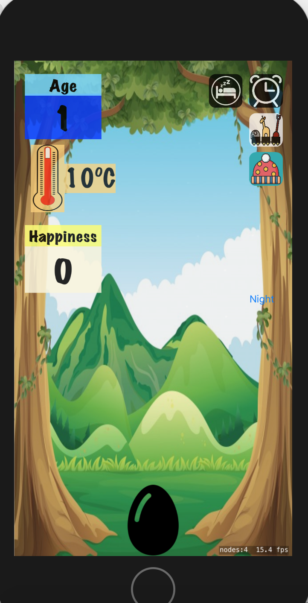
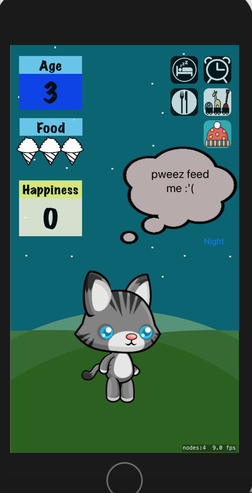

# Team-Agotchi

Welcome
-----
This iOS application allows you to grow and nurture your very own Tamagotchi. The game initialises with an egg which requires heating up in order to hatch. Once the egg has hatched, the creature has certain basic needs. It requires food, it needs to have fun and it needs to have its mess cleaned up. As time passes, the creature will grow hungry and bored, ultimately becoming sick. If neglected for too long, the creature will die. If you over feed the creature, it will go to the loo. If you don't clean up its mess, it will get sad. Similarly, if you don't entertain the creature it will become unhappy. The aim is to keep the creature alive and happy.

Technologies
-----
- Swift 4, XCode 9, SpriteKit

How to Install
-----
In your command line type the following in order to clone this repository:
````
  $ git clone https://github.com/benjaminsunderland/Tamagotchi
````

How to Run
-----
Open Tamagotchi.xcodeproj, connect and select your iphone, then press the play button.





Collaborators
----
Benjamin Sunderland, James Hughes, Sunali Seth, Rory Hodgson and Robin Collins.
